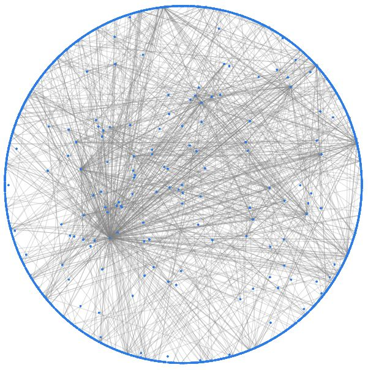

# People Network By Messages 

## Usage

Versions of the **interactive visualizations are included** in the repository. `figure/graph-physics-False.html` and `figure/graph-physics-True.html` can be viewed as they are.
The resulting webpages should look like the following screenshots. 
- Screenshot of `figure/graph-physics-False.html`    
  
- Screenshot of `figure/graph-physics-True.html`  
  **Notice: very slow**  
  
  

## Setup

The following instructions are **only needed for recreating** the two files.

A running neo4j Database is needed:  
https://neo4j.com  

python version: 2.7   
Install python dependencies:
`pip install -r requirements.txt`    
**Extra Windows requirement:**  
MS Visual C++ 9.0 for python [(Download)](https://www.microsoft.com/en-us/download/details.aspx?id=44266)

Database connections need to be configured via `config.ini`. A template is given with `config.sample.ini`.

`python constructDB.py` will generate the neo4j graph database from the smartshark data.  

`python visulization.py` will generate two html based visualizations using `vis.js` (https://github.com/almende/vis.git) from the neo4j graph.  
